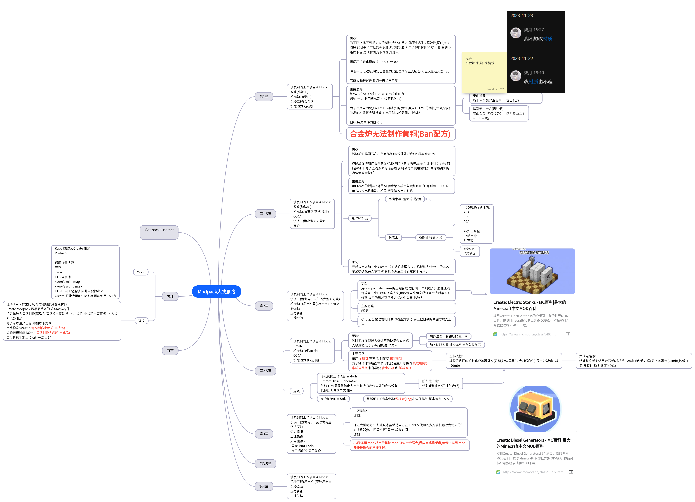

# 这是甚么?

这是一个基于 Minecraft Java 版开发的一个 Modpack,包含了魔改与任务

# 可以介绍一点吗?

啊...突然采访嘛...呜姆...首先,这是一个科技包,从第一章的沉浸工程与机械动力,到后面的 AE 与 Mek

# 这个 Modpack 主要思路是什么?

主要是以科技 Mod 为主叭...我们也不想做那种混有冒险的 Modpack,我们想做一个纯科技的科技 Modpack

# 这个 Modpack 有些甚么?

嘛...主要就是生产线啥的嘛...目前的 Mod 有
沉浸工程
机械动力
Mek
AE 2
工业先锋
匠魂
压缩空间
热力膨胀
之类的

# 那用什么魔改呢?

主要是 MBD KubeJs datapack 同时进行吧..?目前的打算是这样的,后面可能会加,什么?没有使用 CrT 的打算

# 在做这个包之前有甚么准备吗?

呜姆...准备肯定有了啦...和朋友准备了...嘶...两个月?不记得惹...可以看看下面的思维导图..
